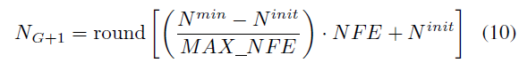

# 2013-Shade

## Key Point

- Base on Shade
- Lshade adopts a Linear Population Size Reduction
  - 
  - By using reduction method, it can search much larger space first for the sake of not fill in local optima. When population size decrease, we can focus on optimize the local optima to get better result.
- CR: Change plan, add terminal value 「⊥」 to set CRi to 0.
- H: Archieve size will reduce with the population size.
- 
## How to Run
```g++ main_lshade.cpp```

i. 
```
./run.ps1
[filename]
[run_times]
```

ii. ```./a.exe [Run] [Func] [NP] [FESS] [Dim] [Arch] [H] [NPmin]```
- NP : 100(paper recommended)
- FESS : NP*GEN
- Arch : 1->size with NP , 0-> size with 0
- H : size of success history
- NPmin：minimize for the np size
